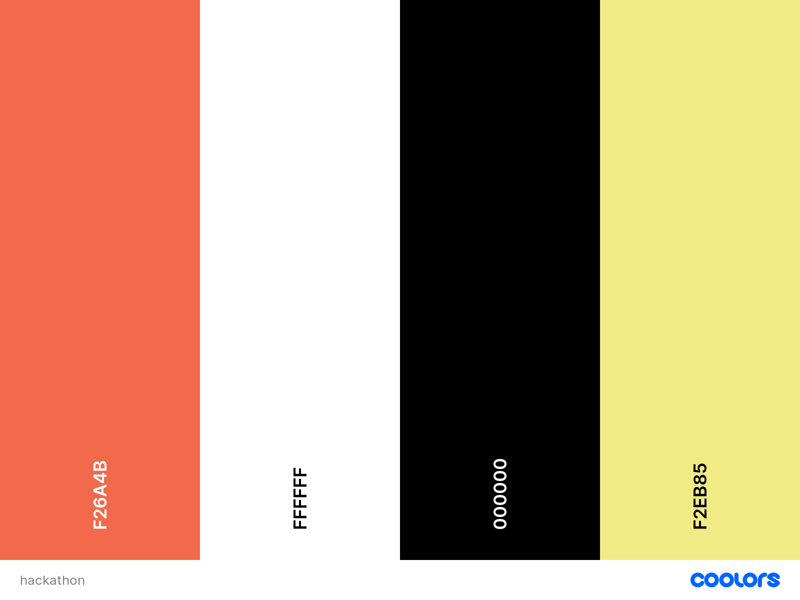

# **Solve The Gender Gap In Tech?**

## **Introduction**

This project aims to help address the gender gap issue of women in tech. Women are dropping out of tech and STEM subjects very early on in their education. This project will allow women who are currently working in tech to volunteer their time to mentor girls and women who are currently studying tech and STEM subjects in high school and university. 

## **Table of contents** 

### **1. User Experience (UX)**
  * 1.1 Target audience
  * 1.2 Visitor goals
  * 1.3 Business goals
  * 1.4 User stories
  * 1.5 Design choices
  * 1.6 Wire frames

### **2. Features**
  * 2.1 Navbar
  * 2.2 Mentor cards
  * 2.3 Student cards 
  * 2.4 Register as student/mentor 
  * 2.5 Women in tech stats 
  * 2.6 Quiz
  * 2.7 Footer

### **3. Technologies/Languages Used**
  * 3.1 Gitpod
  * 3.2 HTML5
  * 3.3 CSS
  * 3.4 JavaScript
  * 3.5 Bootstrap
  * 3.6 Google Font 
  * 3.7 Balsamiq
  * 3.8 Favicon.io
  * 3.9 Git (Version control)

### **4. Testing**
  * 4.1 See [testing.md](testing.md) document 

### **5. Deployment**

  * 5.1 Deployment 
  * 5.2 Cloning 
  * 5.3 Cloning Desktop

### **6. Credits**
  * 6.1 Media
  * 6.2 Code

### **7. Contact**
  * 7.1 LinkedIn
  * 7.2 Email
  * 7.3 Skype
  * 7.4 My portfolio page

### **8. Disclaimer**

  * 8.1 Disclaimer on project 

<strong>1. User Experience (UX)</strong>

 

#### **1.1 Target Audience**

This project is aimed at two audiences. The first audience is any woman who is currently working in the field of tech/STEM and who wishes to volunteer her time to act as a mentor to younger women in school and university who are working towards a career in tech/STEM.

The second audience the site is aimed at is girls who are currently in high school or university and who wish to pursue a career in tech/STEM.

#### **1.2 Visitor goals** 

* As a student, or woman considering a career in tech i want to be able to search this site for mentors that may be able to mentor me during my education in tech/STEM. I want to be able to post my profile to the site as well so mentors who are listed on the site can see the subjects i am interested in and that i am perusing. 

* For women who are currently working in tech/STEM i want to be able to post my profile on the site so students can see what field i specialize in and for them to contact me to request mentor assistance. 

#### **1.3 Business goals**

* No business or monetary goals, the site is aimed at helping support young women during their education years so they may choose and stick with a career in tech/STEM. 

#### **1.4 User Stories**

As a visitor to the company website i expect/want/need
 
**Student** 
As a woman who is starting to study tech/STEM in university i want to be able to come to the website and see if i can find a woman who is already working in the field of tech/STEM, who may be able to offer me mentoring support. 

I expect to be able to find a mentor who has expertise on the languages and technologies that i am studying so it would be a suitable mentor match. 

**Mentor**
As a woman who wants to help address the issue of young women dropping out of tech/STEM, i want to be able to come to the website and register my details to let women know i am willing to volunteer my time as a mentor.

I expect to be able to read the profile of each girl/woman who is looking for a mentor. I also expect to see what tech?STEM she is interested in or studying for so i can know if i may be suitable as a mentor.  

#### **1.5 Design choices** 

* 

#### **FONTS**

* 

#### **ICONS**

*   

#### **COLORS**

* The color scheme we have used for the project can be found below:

#### **1.6 Wire Frames** 

* The wireframes for the project can be seen below. There is a wireframe for desktop, tablet and mobile.

#### **DESKTOP**

#### **TABLET**

#### **MOBILE**

<strong>2. Features</strong>

 

#### **2.1 Navbar** 

The Navbar we used is a standard Bootstrap Navbar. We chose this because it offers mobile responsiveness and as we don't have many pages on the project a simple Navbar will suffice. 

#### **2.2 Mentor cards**

The mentor card will detail information about the mentor who is volunteering their services on the site. The mentor card will include:

1. A title e.g. Engineering Mentor
2. The name of the mentor
3. An image of the mentor
4. The specialty of the mentor
5. The mentors current job description
6. A logo of the company they are employed by
7. A personal statement of the mentor to include current role, relevant work related experience.
8. A link button titled Be My Mentor which takes you to a form where you can fill in your details to connect with the mentor. 
9. A link button titled Availability which takes you to the mentor calendar.
10. A card titled Education which includes most recent qualifications and logos of the places of education.
11. A 2nd card titled Licenses, or skills if not applicable to include logos of education providers, the qualification skill and the name of the education 
provider.

#### **2.3 Student cards**

The student card will detail information about the student who is looking to find a mentor. The student card will include:

1. A title e.g. Student
2. The name of the student
3. An image of the student
4. The area of study/interest for the student
5. Paragraph detailing a bit more about the student.
6. The be my mentor button 
7. A card for education showing where the student is studying or graduated from
8. An icon of their school/university
9. List of their grades
10. A list of the students hobbies and interests 

#### **2.4 Register as student/mentor**

The contact us page is where both students and mentors can register their details with the site. There are 2 buttons on the page, one for mentors, one for students. When the user clicks the button relevant to them a modal will open prompting the user to enter their details and submit them to the site for approval. 

#### **2.5 Women in tech stats**

The women in tec stats page shows data pulled from different sources. It shows users what countries are leading the way in addressing the women in tech gender gap. It also highlights how the shortage of women in tech can be traced as far back as high school.

The page also shows how the field of computing used to be dominated by women. We also list how women have made their way to the top of some of the biggest tech companies in the world and to show them what is possible in their career.

At the bottom of the page we have a number of videos where users can hear directly from women who are already working successfully in the tech/STEM field. 

#### **2.6 Quiz**

The quiz page is a JavaScript page and visitors to the site can answer a number of questions that are relevant to people who are either pursuing, or are considering a career change into the world fo tech. All of the questions are yes or no and at the end of the quiz user will get a message giving them feedback as to if they may be suited to a career in tech.

#### **2.7 Footer**

* The footer is a basic bootstrap footer that contains the copywrite info.

<strong>3. Technologies/Languages Used</strong>

 

3.1 [Gitpod](https://www.gitpod.io/) - Is the IDE we used for this project 
3.2 [HTML5](https://html.com/html5/#What_is_HTML) - This is the markup language we used for this project. 
3.3 [CSS](https://en.wikipedia.org/wiki/CSS) - We used CSS to help alter and adjust the presentation of the website to create a pleasant user experience. 
3.4 [JavaScript](https://en.wikipedia.org/wiki/JavaScript) - JavaScript was used to write the quiz page on the project 
3.5 [Bootstrap](https://getbootstrap.com/) - Bootstrap is the most popular CSS Framework for developing responsive and mobile-first websites. Bootstrap 5 is the version we used for the development of this project. 
3.6 [Google fonts](https://fonts.google.com/) - Launched in 2010 Google Fonts is a library of 1,023 free licensed font families. 
3.7 [Balsamiq](https://balsamiq.com/)- Balsamiq Wireframes is a rapid low-fidelity UI wireframing tool that reproduces the experience of sketching on a notepad or whiteboard. 
3.8 [favicon.io](https://favicon.io/) - Favicon.io is the free favicon generator i used for the project 
3.9 [Git](https://git-scm.com/) - Git is free and open source software for distributed version control: tracking changes in any set of files.

<strong>4. Testing</strong>

 

* Testing information can be found in the [testing.md](testing.md) file

<strong>5. Deployment</strong>

 

#### **5.1 Deployment**  

To deploy the site on Github i undertook the following steps:

1. Navigated to my profile page on Github
2. Selected this project from the repositories
3. Clicked on settings
4. Click on pages which is on the left which is in the code and automation section
5. Click where is says source and in the dropdown menu select master 
6. Click on the next dropdown menu to the right select /(root)
7. Click save

You will then receive a confirmation saying the page has been published and also be provided with the link where people can view your site.

The link to view the live site can be found by clicking [Here]()

#### **5.2 Cloning**

You can clone the projects repository to your local computer by following the steps below:

Cloning a repository using the command line

1. On github navigate to the project repository. The link can be found here: 
2. Click on the tab that says < >code 
3. Click the copy button on the right under the HTTPS tab
4. Open the terminal in your IDE
5. Change the current working directory to the location where you want the cloned directory.
6. In terminal type `git clone` and then paste the URL you copied earlier 
7. Press Enter to create your local clone.

#### **5.3 Cloning Desktop**
You can also clone the project using Github Desktop. To do this you can do the following: 

1. On github navigate to the project repository. The link can be found here: 
2. Click on the tab that says code 
3. Click on Download ZIP.
4. Unzip the repository after it downloads to your machine and then drag the unzipped files into your IDE.

<strong>6. Credits</strong>
 
 

#### **6.1 Media** 

* The majority of the images used are from the free image site Unsplash. 

#### **6.2 Code** 

* All of the code in the project was written by:

1. Stephen Mc Govern 
2. Sorin Andrei
3. Mark Stephenson
4. Martin Pavlin
5. Mihai Elisei

<strong>7. Contact</strong>

 

Feel free to contact us on any of the following channels:

 

<strong>8. Disclaimer</strong>

 

* 8.1 There is no monetization generated from this site. It is only intended as an educational project and proof of concept during a Hackathon. 

